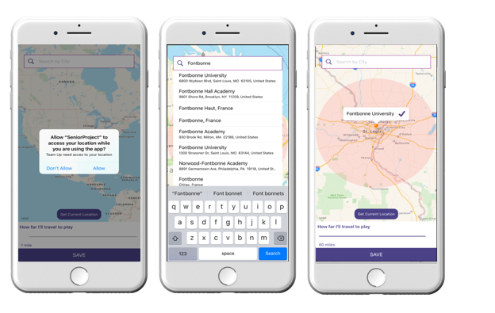
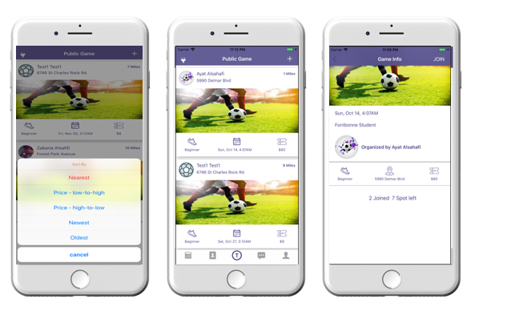
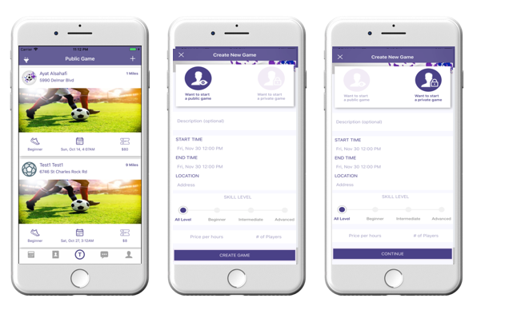
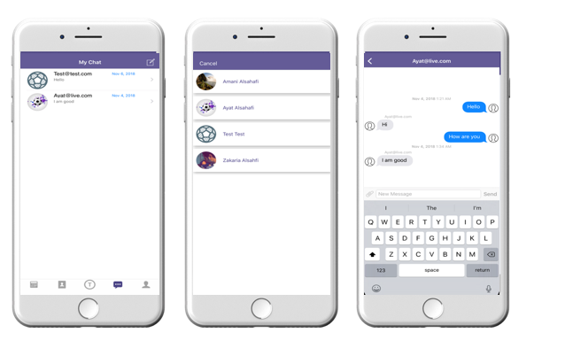
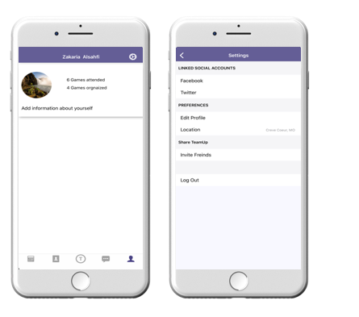

# Senior_Project
The app allows users to create sports events that enable nearby users to join. In a public event, the inclusions are the place, time, date, the number of players required and the amount that another user needs to pay in order to join the event. The event is displayed based on the user's destination. This allows the event organizer to know the attendance of the event thus enhancing transparency. One is also able to control the number of participants in the game by use of the application. It is central to the private event thus creating the difference between a public event and the private event in use of the Teamup. In a private event, the user gets to choose the people to be allowed to join in the event.

App Screenshots

**Create New Account**

**Setup location**

**Public Game View**

**Create a New Game**

**User Game View**

**Chat View**

**User Profile**

